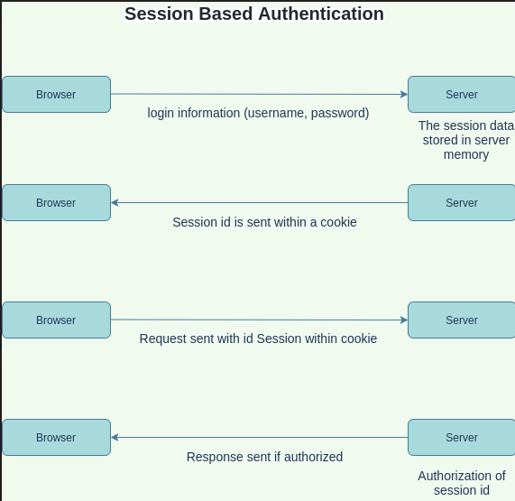
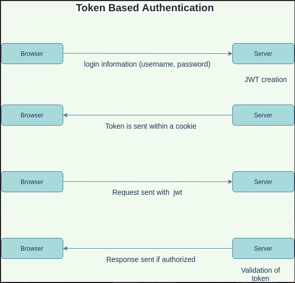

# Week7-Research-Sondos

## HTTP vs HTTPS

### SSL
SSL stands for Secure Sockets Layer and, it's the standard technology that used to make the data sent between two systems secure and safe, and can't be read.

To create this secure connection, an SSL certificate is installed on a web server and serves two functions: authentication of the browser, encryption of the data that’s being transmitted

### TLS
TLS stands for Transport Layer Security, it is just an updated, more secure, version of SSL. it protects the transmitted data between the server and the client.

### HTTPS
Https takes the http protocol and uses SSL to form a layer of protection on it, the connection process between the two system will extend for the whole session, and only the server and the client can see the data.

### HTTP

the sent data between the server and the client are readable and without protection, the connection between them will be only when the request sent(connection-less)

## Stateless vs stateful authentication

### Session Based Authentication

In this method of authentication, the user state will be stored in the server, which creates the session and stores its data. the session id will be sent within the cookie to the browser, to be sent in requests. the server then will compare between the sent session data and the stored one, and send the response if authorized.

`Advantages: `

 - Having HttpOnly Flag will secure the cookie from malicious JavaScript attacks.
 - By creating cookies in the server and inserting ‘set-cookie’ in the response header, the browser will automatically send the authentication information on every subsequent request to the server

`Disadvantages: `
 - The main disadvantage is that it makes use of the server's memory which can be a problem when there is a large number of users using the system.
 - CSRF Attack.

 
   

### Token Based Authentication

In this method, the user state will be stored on the client side only, the server will create JWT to be sent to the browser and stored there, and sent with each request. the server will validates the token and send the response based on the result.

`Advantages: `

- The server no longer have to bear the overhead of session information
- The main benefit of being stateless is less complexity and logic in the application. Thus, it will be easier to manage, scale, decouple, and it’s less prone to error.
- Token-based authentication is not suspectable to CSRF attacks, since attacker site will first need to steal the token before it can make the AJAX call to the legitimate website.

`Disadvantages: `
- Applications that implement token-based authentication will need to be aware of Cross-Site Scripting Attacks.
- The size of JWT can be relatively large compared to a session cookie.

 
   

## Session-management in Express

 Sessions are identifiers sent from the server and stored on the client-side. On the next request, the client sends the session token to the server. Using the identifier, the server can associate a request with a user.

## Attacks

### Man In The Middle (MITM)
It happens when the attacker insert himself in the connection between two ends, and be able to access the transmitted information between them.
  - Spoofing : each end will send the information to the attacker, causing a disconnection between ends.
  - Packet forwarding : the attacker can invisibly view the traffic between the ends without destroying it.

`Best Practices to Prevent Man-in-the-Middle Attacks:`

- HTTPS can be used to securely communicate. This prevents an attacker from having any use of the data he may be sniffing.
-  Public key pair based authentication like RSA can be used to make sure that the things you are communicating with is that what you want.

### Cross Site Scripting (XSS)
It happens when the attacker add malicious code to the browser client-side, for example adding code in some input section, that will be executed when a user perform certain event, so that his cookie will be sent to the attacker, and he can do whatever that user can do. SO, if the web app is not validated enough, the browser will give the attacker the access to any cookies, session tokens, or other sensitive information.

`Best Practices to Prevent Cross Site Scripting Attacks:`

  - Escaping : By escaping user input, key characters in the data received by a web page will be prevented from being interpreted in any malicious way.
  - Validating input is the process of ensuring an application is rendering the correct data and preventing malicious data from doing harm to the site, database, and users.
   - Cookies that are used for sensitive actions (such as session cookies) should have a short lifetime.
   - Using Http only flag in cookies.

### Cross Site Request Forgery (CSRF)
It allows the attacker to make the users perform actions on they don't want to perform, on the web application, while they are authenticated. A CSRF attack works because browser requests automatically include all cookies including session cookies. Therefore, if the user is authenticated to the site, the site cannot distinguish between legitimate requests and forged requests. 
A successful attack, could result in a changing users emails or passwords, or a transfer of funds.

To defend against that, we should include a CSRF token within the requests, that is Unpredictable, and to validate before each action.